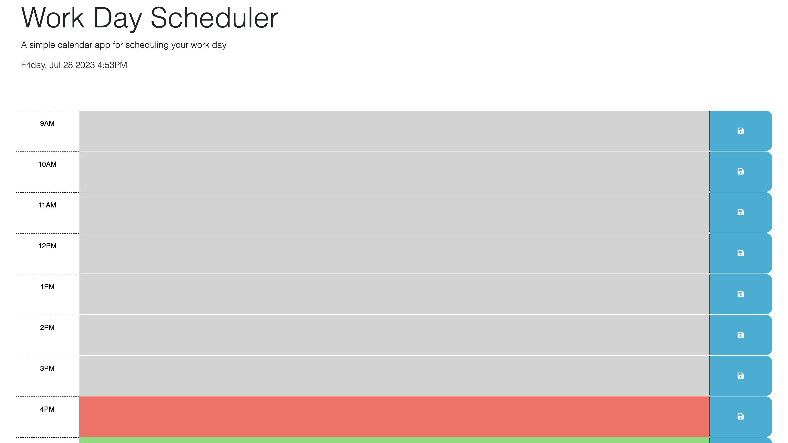

# 05 Third-Party APIs: Work Day Scheduler

## Your Task

Create a simple calendar application that allows a user to save events for each hour of the day by modifying starter code. This app will run in the browser and feature dynamically updated HTML and CSS powered by jQuery.

## Description

This calender application is designed to help people save important time slots and events in a easy to use and view calender. users can enter their events based on the hour and save them. Based on current time, That our slot will change color, grey if it is in the past, red if it the current time slot, and green if it is in the future. 

